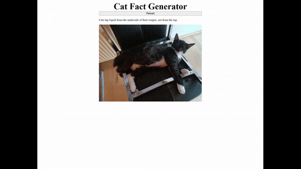

# Challenge #1

## Steps:

- Create and start entrypoint of React without template. ✅
- Retrieve a random fact from `https://catfact.ninja/fact`. ✅
- From the first word of the fact, retrieve a random cat image from `https://cataas.com/cat/says/`. ✅
- Create a button to generate a new fact and image. ✅
- Separate the logic of the app into separate files. ✅
- Refactor with Custom Hook for the logic. ✅
- Create basic tests. ✅
  
